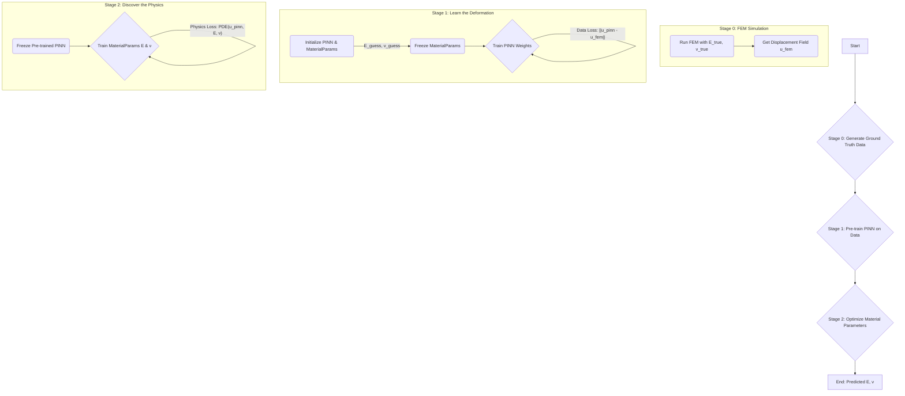

# PINN for Inverse Material Parameter Identification

This document explains the architecture and workflow of the PINN-based model used to solve an inverse problem: identifying the material properties (Young's Modulus `E` and Poisson's Ratio `ν`) of a cantilever beam.

## 1. Prerequisites

To run this code, you need a Python environment with the necessary packages installed. The project is set up to use Conda.

1. **Install Conda**: Ensure you have Miniconda or Anaconda installed.
2. **Create Environment**: Navigate to the project's root directory (`PINN_Test`) and create the Conda environment using the provided file:

    ```bash
    conda env create -f environment_w_jax.yml
    ```

3. **Activate Environment**: Activate the newly created environment before running the script:

    ```bash
    conda activate pinn-jax-env
    ```

## 2. The Inverse Problem: Finding What Materials Are Made Of

In many engineering scenarios, we can observe how an object deforms under stress, but we don't know its exact material properties. The goal of this project is to determine these properties (`E` and `ν`) by using a neural network.

We use a **Physics-Informed Neural Network (PINN)**. Unlike a standard neural network that only learns from data, a PINN is also constrained by the physical laws governing the system—in this case, the equations of linear elasticity.

## 3. A Multi-Stage Training Architecture

Directly training a neural network and the material parameters simultaneously is often unstable. The network weights and the physical parameters have vastly different scales and sensitivities. To solve this, we use a more robust, sequential, three-stage architecture.

This workflow separates the problem into manageable parts: first learn the shape of the solution, then use that shape to find the physics that define it.

### Workflow Diagram



## 4. Detailed Workflow Breakdown

The entire process is orchestrated by the `pinn/iterative_trainer.py` script.

### Stage 0: Generating "Ground Truth" Data

- **What:** We start by creating a high-fidelity dataset to train on.
- **How:** We use a standard **Finite Element Method (FEM)** solver (from `LinearElasticity/simulation.py`) with the *true* material parameters (`E_true`, `ν_true`). This simulation computes the displacement `u(x,y,z)` for points on the beam.
- **Result:** A set of `(coordinates, displacement)` pairs that represent our experimental data.

### Stage 1: PINN Pre-training (Fitting to Data)

- **Goal:** Train the PINN to be a perfect mimic of the FEM solution. At this stage, the PINN's only job is to learn to map input coordinates `(x,y,z)` to the correct output displacement `u`.
- **How:**
    1. We initialize the PINN and the `MaterialParameters` (with incorrect starting guesses, e.g., `E=50e3`, `ν=0.2`).
    2. We **freeze the `MaterialParameters`**. Only the neural network's weights and biases are trainable.
    3. The network is trained using only a **data-matching loss**: `L_data = ||u_pinn - u_fem||²`. This is a standard supervised learning task.
- **Result:** A neural network that is a differentiable, continuous function accurately representing the beam's deformation field.

### Stage 2: Parameter Optimization (Fitting to Physics)

- **Goal:** Now that we have a good function for the deformation field (`u_pinn`), we use it to find the material parameters that make the solution physically correct.
- **How:**
    1. We **freeze the PINN's weights**. The network's architecture is now static.
    2. The only trainable variables are `E` and `ν` within the `MaterialParameters` object.
    3. The optimizer's goal is to minimize the **physics loss**, which is composed of two parts:
        - `L_pde`: The **PDE residual**. We plug the PINN's output (`u_pinn`) and the current estimates for `E` and `ν` into the governing equations of linear elasticity. If the parameters are correct, the equation's residual will be zero.
        - `L_bc`: The **Boundary Condition loss**. This ensures the solution respects the physical constraints of the problem (e.g., the beam is fixed at one end).
- **Why it Works:** Because the PINN is a differentiable function, we can use JAX's automatic differentiation to compute the gradient of the `L_physics` with respect to `E` and `ν`. The optimizer follows this gradient, iteratively updating `E` and `ν` until they converge to values that satisfy the underlying physics.

## 5. How to Run the Script

1. Make sure your `pinn-jax-env` conda environment is activated.
2. Navigate to the root directory of the project (`PINN_Test`).
3. Run the main trainer script:

    ```bash
    python pinn/iterative_trainer.py
    ```

4. The script will print its progress for each stage. Final results, logs, and plots will be saved to a new, timestamped directory in `pinn/results/`.
