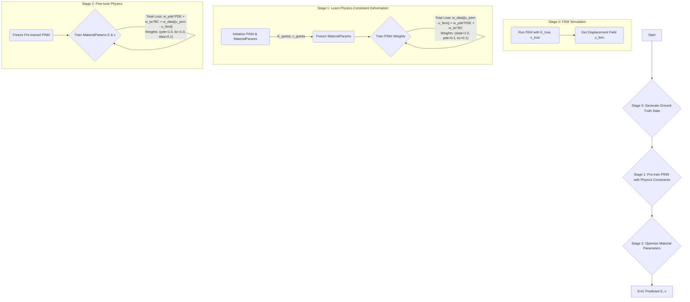

# PINN for Inverse Material Parameter Identification

This document explains the architecture and workflow of the PINN-based model used to solve an inverse problem: identifying the material properties (Young's Modulus `E` and Poisson's Ratio `ν`) of a cantilever beam.

## 1. Prerequisites

To run this code, you need a Python environment with the necessary packages installed. The project is set up to use Conda.

1. **Install Conda**: Ensure you have Miniconda or Anaconda installed.
2. **Create Environment**: Navigate to the project's root directory (`PINN_Test`) and create the Conda environment using the provided file:

    ```bash
    conda env create -f environment_w_jax.yml
    ```

3. **Activate Environment**: Activate the newly created environment before running the script:

    ```bash
    conda activate pinn-jax-env
    ```

## 2. The Inverse Problem: Finding What Materials Are Made Of

In many engineering scenarios, we can observe how an object deforms under stress, but we don't know its exact material properties. The goal of this project is to determine these properties (`E` and `ν`) by using a neural network.

We use a **Physics-Informed Neural Network (PINN)**. Unlike a standard neural network that only learns from data, a PINN is also constrained by the physical laws governing the system—in this case, the equations of linear elasticity.

## 3. A Multi-Stage Training Architecture

Directly training a neural network and the material parameters simultaneously is often unstable. The network weights and the physical parameters have vastly different scales and sensitivities. To solve this, we use a more robust, sequential, three-stage architecture.

This workflow separates the problem into manageable parts: first learn the shape of the solution, then use that shape to find the physics that define it.

### Workflow Diagram



## 4. Detailed Workflow Breakdown

The entire process is orchestrated by the `pinn/iterative_trainer.py` script.

### Stage 0: Generating "Ground Truth" Data

- **What:** We start by creating a high-fidelity dataset to train on.
- **How:** We use a standard **Finite Element Method (FEM)** solver (from `LinearElasticity/simulation.py`) with the *true* material parameters (`E_true`, `ν_true`). This simulation computes the displacement `u(x,y,z)` for points on the beam.
- **Result:** A set of `(coordinates, displacement)` pairs that represent our experimental data.

### Stage 1: PINN Pre-training (Learning Physics-Consistent Deformation)

- **Goal:** Train the PINN to accurately represent the beam's deformation field while ensuring it respects the underlying physics. This creates a strong foundation for material parameter optimization.
- **How:**
    1. We initialize the PINN and the `MaterialParameters` (with incorrect starting guesses, e.g., `E=50e3`, `ν=0.2`).
    2. We **freeze the `MaterialParameters`**. Only the neural network's weights and biases are trainable.
    3. The network is trained using **all three loss components** with carefully chosen weights:
        - **High weight on data loss** (`w_data = 1.0`): Primary focus on matching the FEM solution
        - **Moderate weights on physics losses** (`w_pde = 0.1`, `w_bc = 0.1`): Ensures the solution respects physical laws
- **Why This Works:** By including physics constraints during pre-training, the PINN learns a deformation field that is both accurate (matches data) and physically plausible. This prevents the network from learning non-physical shortcuts that would make Stage 2 optimization impossible.
- **Result:** A neural network that represents a physically consistent, differentiable approximation of the beam's deformation field.

### Stage 2: Parameter Optimization (Fine-tuning Physics)

- **Goal:** Now that we have a physics-consistent approximation of the deformation field, fine-tune the material parameters to achieve the best possible satisfaction of the governing equations.
- **How:**
    1. We **freeze the PINN's weights**. The network's architecture is now static.
    2. The only trainable variables are `E` and `ν` within the `MaterialParameters` object.
    3. The optimizer uses **all three loss components** with rebalanced weights:
        - **High weights on physics losses** (`w_pde = 1.0`, `w_bc = 1.0`): Primary focus on satisfying governing equations
        - **Lower weight on data loss** (`w_data = 0.1`): Maintains connection to experimental observations
- **Why it Works:** Because the PINN already represents a physically plausible solution from Stage 1, the optimization landscape for the material parameters is well-behaved. The physics losses can effectively guide the parameters toward their true values while the data loss prevents drift from the experimental observations.
- **Result:** Material parameters `E` and `ν` that best explain the observed deformation according to the laws of linear elasticity.

## 5. How to Run the Script

1. Make sure your `pinn-jax-env` conda environment is activated.
2. Navigate to the root directory of the project (`PINN_Test`).
3. Run the main trainer script:

    ```bash
    python pinn/iterative_trainer.py
    ```

4. The script will print its progress for each stage. Final results, logs, and plots will be saved to a new, timestamped directory in `pinn/results/`.

## 6. Key Insight: Why Both Stages Need All Loss Components

The critical insight in this implementation is that **both training stages use all three loss components** (data, PDE, and boundary conditions) but with different relative weights:

- **Stage 1 Priority**: Learn accurate deformation field (`w_data = 1.0`) while respecting physics (`w_pde = w_bc = 0.1`)
- **Stage 2 Priority**: Satisfy governing equations (`w_pde = w_bc = 1.0`) while maintaining data consistency (`w_data = 0.1`)

This approach ensures:
1. **Stage 1** produces a physics-aware approximation, not just a data-fitting curve
2. **Stage 2** can successfully optimize material parameters because the PINN already represents a physically plausible solution
3. **Stability** throughout the optimization process by maintaining connections to both experimental data and physical laws

The alternative approach (Stage 1 with data-only loss, Stage 2 with physics-only loss) often fails because the pre-trained PINN may represent a deformation field that cannot be achieved with any reasonable material parameters, making Stage 2 optimization impossible or unstable.
